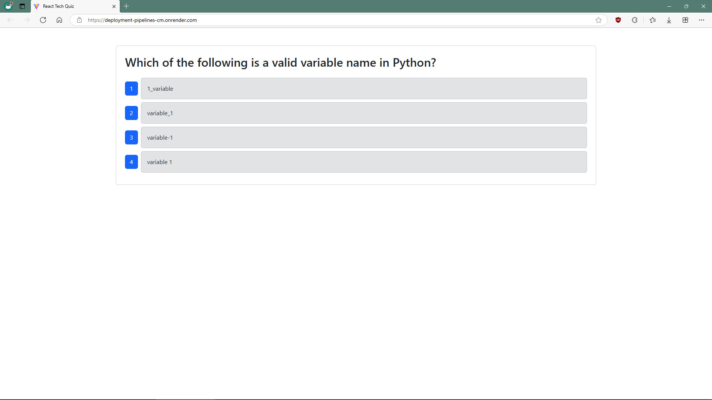

# Deployment-Pipelines-CM
[](https://opensource.org/licenses/MIT)

## Description

A quiz program that allows aspiring developers to test their tech knowledge.



## Table of Contents

- [Installation](#installation)
- [Usage](#usage)
- [Contributing](#contributing)
- [Tests](#tests)
- [Questions](#questions)
- [License](#license)

## Installation

Run the "npm install" script for Node Package Manager to download all of the required dependancy files. Configure the .env file for your system specifications. Execute the "npm run build" script to transpile the typescript code into javascript. Seed the MongoDB NoSQL database with the "npm run seed" script.

## Usage

Execute the "npm run start" script to start the server. Follow the on-screen prompts to test your tech knowledge. See the deployed web application at the following link.

[Deployed Web App](https://deployment-pipelines-cm.onrender.com/)

## Contributing

Contact Christopher Makousky for inqueries on making contributions to this project.

## Tests

Run the "npm run test-component" script to execute the provided Cypress test schema. Alternatively, the "npm run test-gui" script will allow for testing through the Cypress GUI.

```md
GIVEN a fullstack application for a web developer,

WHEN I upload new features to the application
THEN I should be making Pull Requests to a develop branch first

WHEN I create a Pull Request to a develop branch
THEN I should be executing a GitHub Action that checks the Cypress component tests

WHEN I see that the tests pass on GitHub Action
THEN I should see those test results on GitHub Action and merge the code

WHEN I push the code from the develop branch to the main branch
THEN I should see that another GitHub Action triggers and should automatically deploy to Render
```

## Questions

https://github.com/CMakousky

christopher.makousky@gmail.com

## License

MIT License
